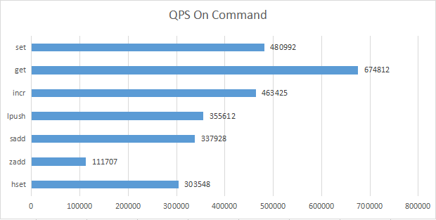
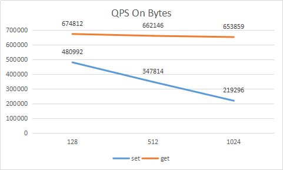

Tendis is a high-performance distributed storage system which is fully compatible with the Redis protocol. It uses RocksDB as the storage engine, and all data is stored to disks through RocksDB. Users can access Tendis using a Redis client, and the application hardly needs to be changed. In addition, Tendis supports storage capacity far exceeding memory, which can greatly reduce user storage costs.

Similar to Redis clusters, Tendis uses a decentralized distributed solution. The gossip protocol is used for communication between nodes, and all nodes in a cluster can be routed to the correct node when a user accesses. Cluster nodes support automatic discovery of other nodes, detect faulty nodes, and ensure the application is almost not affected when the master node failed.

## Documentations([中文](http://tendis.cn))
Checkout [tendis.cn](http://tendis.cn) for design, implementation and operation details.

## Features
- Redis compatibility

  Redis protocol and commands supported in Tendis are compatible with Redis.
  
- Persistent storage

  Using RocksDB as storage engine. All data is stored in RocksDB in a specific format, supporting PB-level storage capacity.

- Decentralized distributed cluster

  Distributed implementation like Redis clusters, using a gossip protocol to intercommunicate between nodes.

- Horizontal scalability

  Data migration online between nodes. High performance and linear scalability up to 1,000 nodes.

- Failover

  Auto-detect non-working nodes, and promote replica nodes to master when a failure occurs.

- Key component for Tendis Hybrid Storage Edition

  Thanks to the design and internal optimization, Redis and Tendis can work together to be Hybrid Storage Edition. It is suitable for KV storage scenarios, as it balances performance and cost, and greatly reduces your business operating costs by 80% in the scenarios where cold data takes up a lot of storage space.

## Get Started

### Requirements

* g++ (required by c++17, version >= 5.5)
* cmake (version >= 2.8.0)

### Build

```
$ git clone https://github.com/Tencent/tendis.git --recursive
$ git submodule update --init --recursive
$ mkdir bulid
$ cd build & cmake ..
$ make -j12
```

### Run and Play
```
$ ./build/bin/tendisplus tendisplus.conf
```
Connect to the server via redis-cli
```
$ redis-cli -p 51002
```

### TEST
You can make some change to the code and make sure the following test  script pass.
```
$ sh ./testall.sh
```

## Performance

### 1. Hardware spec 
CPU:2.50 GHz,48 core
DISK:NVMe SSD
MEM:192GB

### 2. Bechmarks and QPS numbers
tendisplus: workers = 56
```
./memtier_benchmark -t 20 -c 50 -s 127.0.0.1 -p 51002 --distinct-client-seed --command="set \_\_key__ \_\_data__" --key-prefix="kv_" --key-minimum=1 --key-maximum=500000000 --random-data --data-size=128 --test-time=1800
./memtier_benchmark -t 20 -c 50 -s 127.0.0.1 -p 51002 --distinct-client-seed --command="get \_\_key__" --key-prefix="kv_" --key-minimum=1 --key-maximum=500000000 --test-time=1800
./memtier_benchmark -t 20 -c 50 -s 127.0.0.1 -p 51002 --distinct-client-seed --command="incr \_\_key__" --key-prefix="int_" --key-minimum=1 --key-maximum=1000000 --test-time=1800
./memtier_benchmark -t 20 -c 50 -s 127.0.0.1 -p 51002 --distinct-client-seed --command="lpush \_\_key__ \_\_data__" --key-prefix="list_" --key-minimum=1 --key-maximum=1000000 --random-data --data-size=128 --test-time=1800
./memtier_benchmark -t 20 -c 50 -s 127.0.0.1 -p 51002 --distinct-client-seed --command="sadd \_\_key__ \_\_data__" --key-prefix="set_" --key-minimum=1 --key-maximum=1000000 --random-data --data-size=128 --test-time=1800
./memtier_benchmark -t 20 -c 50 -s 127.0.0.1 -p 51002 --distinct-client-seed --command="zadd \_\_key__ \_\_key__ \_\_data__" --key-prefix="" --key-minimum=1 --key-maximum=1000000 --random-data --data-size=128 --test-time=1800
./memtier_benchmark -t 20 -c 50 -s 127.0.0.1 -p 51002 --distinct-client-seed --command="hset \_\_key__ \_\_data__ \_\_data__" --key-prefix="hash_" --key-minimum=1 --key-maximum=1000000 --random-data --data-size=128 --test-time=1800
```
   

### 3. QPS on different payload
tendisplus: workers = 56
```
./memtier_benchmark -t 20 -c 50 -s 127.0.0.1 -p 51002 --distinct-client-seed --command="set \_\_key__ \_\_data__" --key-prefix="kv_" --command-key-pattern=R --random-data --data-size=128 --test-time=1800
./memtier_benchmark -t 20 -c 50 -s 127.0.0.1 -p 51002 --distinct-client-seed --command="get \_\_key__" --key-prefix="kv_" --command-key-pattern=R --test-time=1800
```


we test set for half an hour, and then test get key half an hour. because the data is not big enough, most of the data is in memory, so the get qps for diffrent payload is nearly the same.

## Changelog
Checkout [releases](http://tendis.cn/#/Tendisplus/%E6%95%B4%E4%BD%93%E4%BB%8B%E7%BB%8D/releasenodes) for release history.
## Contributing
For more information regarding contributing issues or pull requests, checkout [CONTRIBUTING](CONTRIBUTING.md)
## Support
Checkout [support](http://tendis.cn/#/support) for FAQs or join our discussion groups.

## License
Tendis is licensed under the GNU General Public License Version 3.0. Copyright and license information can be found in the file [LICENSE.txt](LICENSE.txt).
